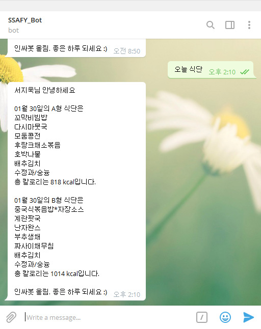

# Telegram Chat Bot, 식단알리미

 https://github.com/spjo21/ssafy_food_chatbot

## I. 스펙(Specification)

구현된 어플리케이션의 주요 기능

#### (1) edu.ssafy.com 공지사항 스크래핑 기능

- edu.ssafy.com 에 로그인 세션을 유지하여 공지사항을 스크래핑하는 기능 구현
- **login 보안 강화로 스크래핑이 불가하여 txt file read 방식으로 변경**

#### (2) 중식 메뉴 공지사항 스크래핑

- 중식 메뉴 공지사항에 있는 표 정보를 스크래핑
- 스크래핑한 데이터를 분석해, 요일별 날짜 데이터, 식단, 칼로리, 휴일 여부 등을 스크래핑

#### (3) Telegram chat bot 을 이용한 식단 알리미

- webhook을 이용한 telegram 채팅 response 기능
- 오늘 식단, 내일 식단, 모레 식단, 어제 식단 등을 채팅 입력 시 알려주는 기능 구현
- telegram chat bot example image :

  

## II. 회고(Retrospective)

어플리케이션 구현 과정에서의 어려움과 문제점

- 스크래핑한 데이터가 날짜별로 정렬이 되어있지 않고, 행별로 정렬되어있어 어려움이 있었다.  
  numpy array를 이용해, reshape 와 transpose 기능을 사용해서 날짜별 식단을 dictionary에 저장하였다.
- 공지사항을 올릴 때 마다 형식이 조금씩 달라져 데이터를 가공하는 방식에 어긋나는 경우가 발생하였다.  
  replace를 이용해 whitespace를 모두 없앤 후 필요한 공백만 넣어주는 방식 채용.
- c9 idle이 켜져있지 않을 시에 webhook이 구동되지 않기 때문에, c9을 구동시켜주어야 한다.

## III. 보완 계획(Feedback)

현재 미완성이지만 추가로 구현할 기능 및 기존 문제점 보완 계획

#### (1) 모든 공지사항 알림 기능

- 공지사항 태그를 이용하여 공지사항을 분류하고 사용자가 원하는 공지를 볼 수 있도록 구현 예정

#### (2) 요일 입력시 요일별 식단 알림 기능

- 제목이 곧 내용, 어렵지 않게 구현 가능할 것

#### ~~(3) C9 IDLE 구동 시 추가 기능~~ 

- 위에서 기술한 것 처럼 idle을 구동해야하기 때문에,
  idle 구동 시에 추가적으로 구독자(getUpdates method 이용)에게 당일 식단을 알려주는 기능 구현
  구독자가 매일 알림을 원하지 않을 경우 알림을 거부하는 명령어를 사용 시, c9 서버에 예외 id를 저장하여,
  구독자 명단에서 제외하고, 또 재 구독을 원할 시에 예외 id에서 지워주는 기능 추가 구현
- **구현완료**